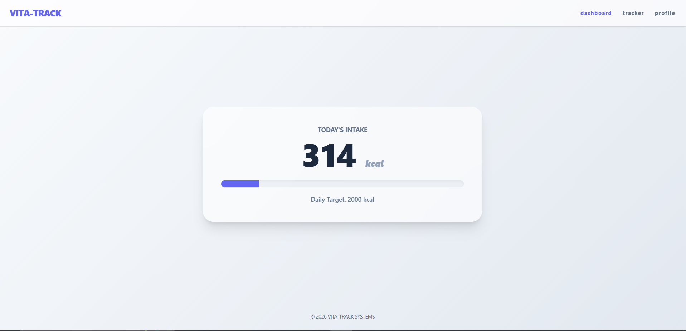
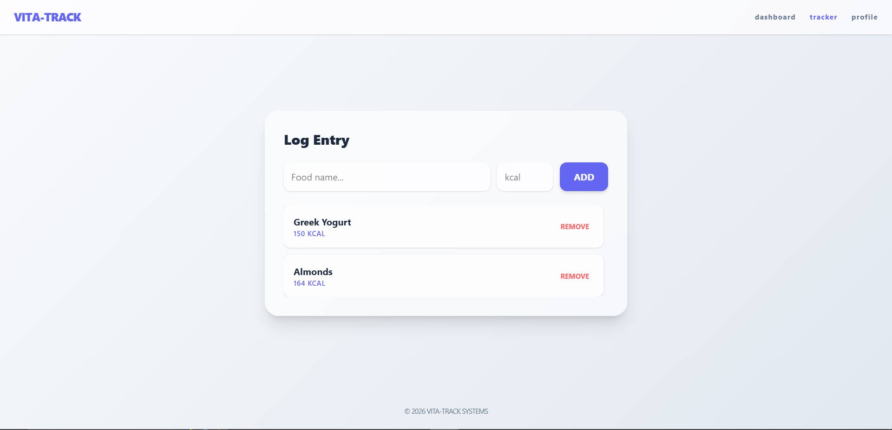
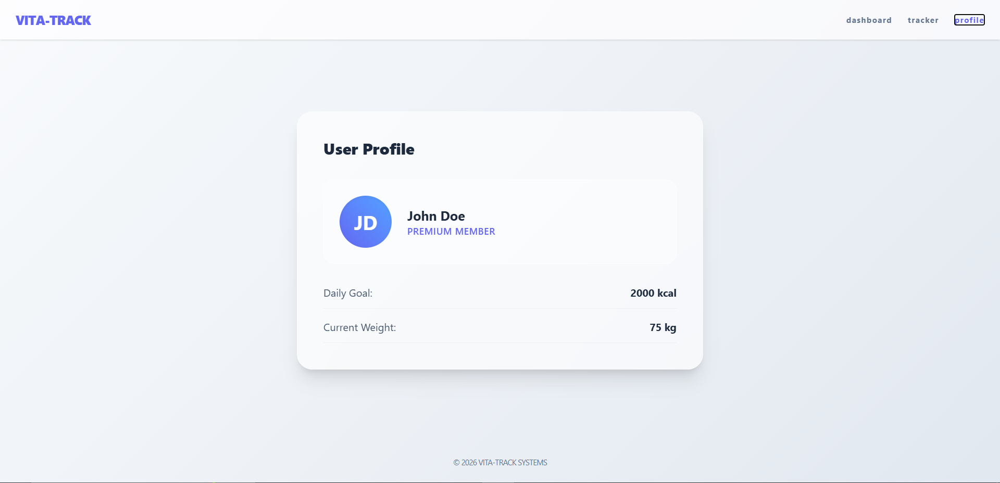

# Vita-Track 

## Contributors
[William Gitau]
---

## Your Path to Nutritional Confidence

Vita-Track is a comprehensive health-tech platform designed to bridge the gap between daily eating habits and fitness goals. It empowers users through a clear data-driven journey: **Log → Analyze → Optimize**.

---

## Problem Statement

A significant percentage of individuals fail to reach fitness goals due to:
- Underestimating daily caloric intake by up to 30%
- Lack of visibility into nutritional trends
- Overly complex tracking interfaces that discourage consistency
- Absence of goal-based visualization

---

## Solution Overview

Vita-Track provides a guided nutritional journey:

| Phase | Description |
|-------|-------------|
| **Log** | Rapid entry of food items and caloric values with instant UI feedback |
| **Analyze** | Real-time dashboard calculating total daily consumption and item averages |
| **Optimize** | Visual progress bars comparing current intake against daily targets |

---

## Design System

**Primary Colors:**
- Indigo (Focus, Clarity)
- Slate (Cleanliness, Professionalism)

**Typography:**
- Headers: Inter / System Sans
- Body: Roboto

**Layout:** Utility-first, card-based responsive grid built with Tailwind v4.

---

## Key Features

- **State-Based Navigation** - Seamless switching between Dashboard, Tracker, and Profile without page reloads.
- **Dynamic CRUD Operations** - Add and remove food entries with immediate state updates.
- **Progress Visualization** - Interactive progress bar that reacts to total calorie count.
- **Component-Based Architecture** - Modular code structure for high maintainability.
- **Responsive Design** - Optimized for mobile tracking on-the-go.
- **User Personalization** - Dedicated profile section for goal setting and user stats.

---

## Tech Stack

| Technology | Purpose |
|------------|---------|
| **React 18** | UI Library & State Management |
| **Tailwind CSS v4** | Modern utility-first styling |
| **Vite** | Fast build tool and development server |

---

## Installation & Setup
To deploy this project locally, follow these steps:

1. **Clone the Repository:**
    ```bash
    git clone [https://github.com/gitauwilly1/calorie-tracker.git]
    ```
2. **Install Dependencies:**
    ```bash
    npm install
    ```
3. **Execution:** Run the development server:
    ```bash
    npm run dev
    ```

---

## Screenshots





---

## Known Bugs
There are no known bugs.

---

## License
* **License:** MIT License.

---

## Support and Information
**Email:** [gitauwilly254@gmail.com]